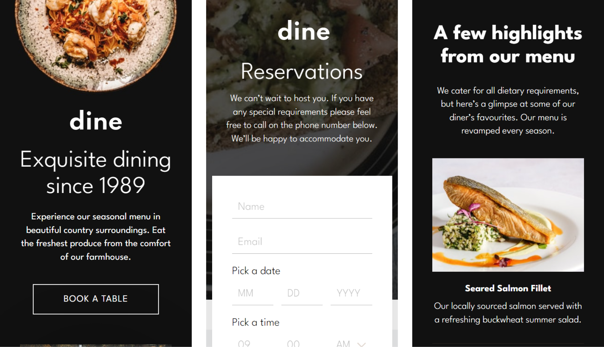

# Dine Restaurant 🍕

Acesse o projeto clicando [aqui](https://filipehibrael.github.io/dine-restaurant-website/)

## 📱 Layout Mobile

## 📖 Sobre

Um site de duas páginas, com um belo design de um restaurante fictício. A primeira página é dividida em seções que apresentam as principais informações do estabelecimento, como localização, contato, horário de funcionamento, menu, etc. Na segunda página, há um formulário com informações para que o cliente possa reservar um horário no local. Projeto disponibizado pelo [Frontend mentor](https://www.frontendmentor.io/)

## 🛠️ Ferramentas Utilizadas

- HTML5
- CSS3
- SASS
- JavaScript
